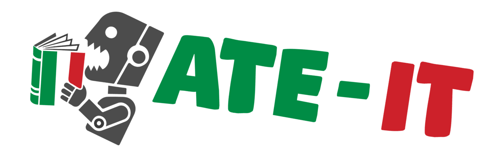

# Home

---
## Automatic Term Extraction (ATE)

ATE is a foundational task in NLP and terminology work. Its goal is to identify **domain-specific terms** that designate key concepts within a specialised field of knowledge. 

ATE differs from Named Entity Recognition (NER) because NER is about identifying and classifying mentions of named entities (e.g., people, organizations, places, dates, products) in running text. Its focus is usually on proper names or unique references that have a clear instance-level referent, and the output is often linked to knowledge bases (e.g., “Barack Obama → Person”, “Google → Organization”).
ATE, by contrast, aims to extract domain-specific terms from a corpus. This means identifying multi-word and single-word terms that are relevant to a field (e.g., “informed consent”, “cryptic species”, “blockchain consensus algorithm”).

The terms extracted through ATE serve as essential building blocks for downstream tasks such as information retrieval, machine translation, ontology construction, knowledge graph enrichment, and domain adaptation of large language models (LLMs).

---
## The ATE-IT Shared Task

The ATE-IT (*Automatic Term Extraction - Italian Testbed*) shared task is part of [EVALITA 2026](https://www.evalita.it/campaigns/evalita-2026/).
It offers the **first large-scale evaluation campaign on Italian ATE**, centred on a clearly defined real-world scenario: term extraction from institutional texts in the domain of waste management.

This domain presents a rich variety of derived terms (e.g., *“ecodizionario”*, *“biodigestore”*), synonyms (e.g., *“indifferenziato”* and *“secco residuo”*), abbreviations (*“TARI”*, *“RAEE”*), and multiword terms (*“mastello contenitore”*, *“raccolta porta a porta”*), making it an important testbed for assessing the robustness of different approaches.

The ATE-IT shared task comprises two subtasks of increasing complexity: [Term Extraction](subtask_a.md) and [Term Variants Clustering](subtask_b.md).

---
### Subtask A - Term Extraction.

Participants will receive a set of sentences drawn from a specialised corpus related to municipal waste management. For each sentence, the goal is to identify and extract the terms that are relevant to the waste management domain. Terms may consist of single words (single-word terms) or multiword expressions (multi-word terms), including noun, verbs and adjectives.

---
### Subtask B - Term Variants Clustering.

From the list of unique extracted terms, participants are then required to cluster together those terms that refer to the same underlying concept. For example, *“raccolta porta a porta”* and *“raccolta domiciliare”* should be placed in the same cluster. Each cluster should represent a single concept within the waste management domain. This subtask focuses on synonymy, lexical variation, and compositional semantics.
Both subtasks are designed to be linguistically and computationally challenging. The first subtask requires models to generalize from sparse domain-specific training examples. The second requires semantic comparison and abstraction over morphologically and syntactically diverse variants.

---
## EVALITA Evaluation Campaign

EVALITA is a periodic evaluation campaign of Natural Language Processing (NLP) and speech tools for the Italian language. It is an initiative of the [Italian Association for Computational Linguistics (AILC)](http://www.ai-lc.it/).

For further information about EVALITA, please visit [www.evalita.it](https://www.evalita.it/).

---
## Sections
- [Participation Guidelines](guidelines.md)
- [Subtask A - Term Extraction](subtask_a.md)
- [Subtask B - Term Variant Clustering](subtask_b.md)
- [Data](data.md)
- [Organizers](organizers.md)
- [Contacts](contacts.md)
